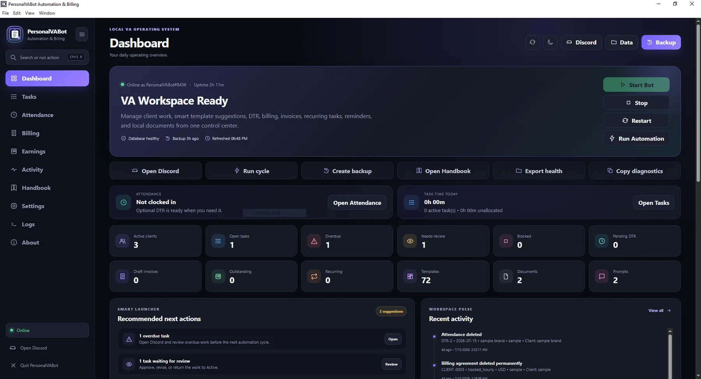
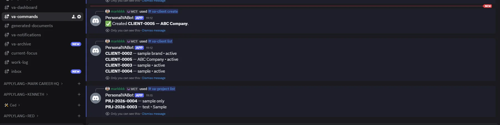
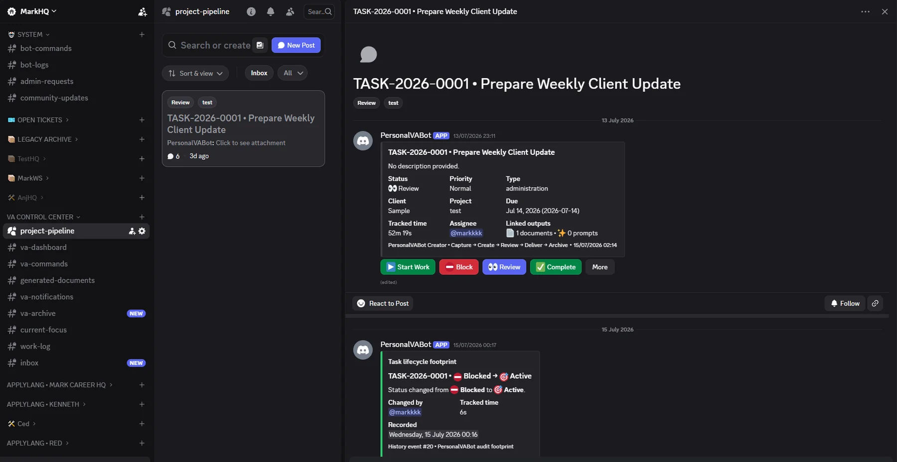
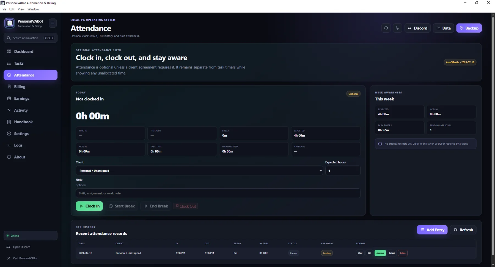
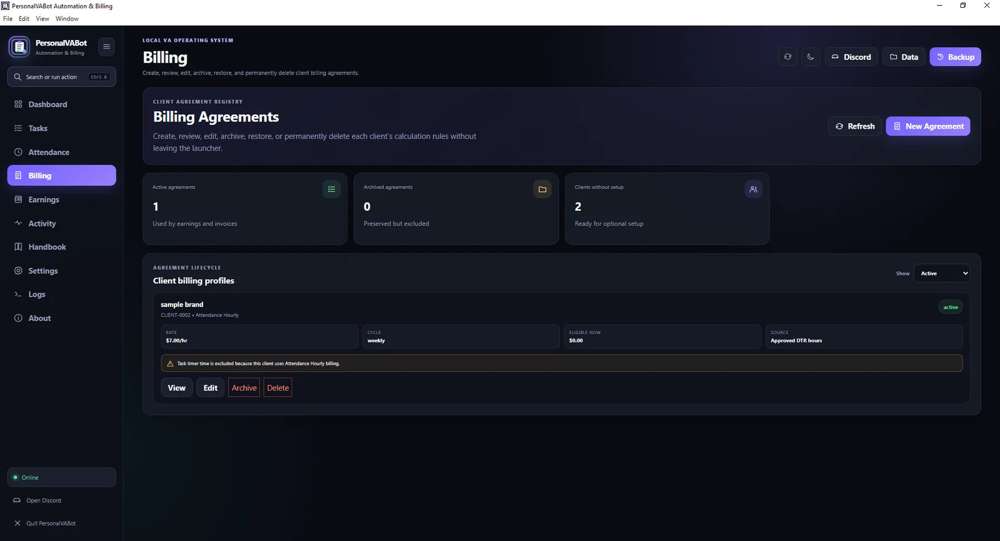
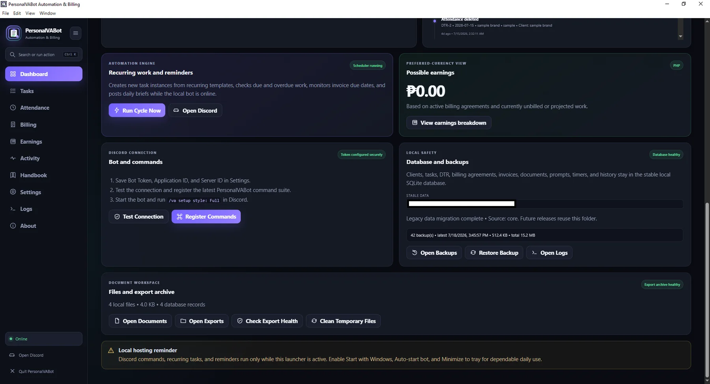
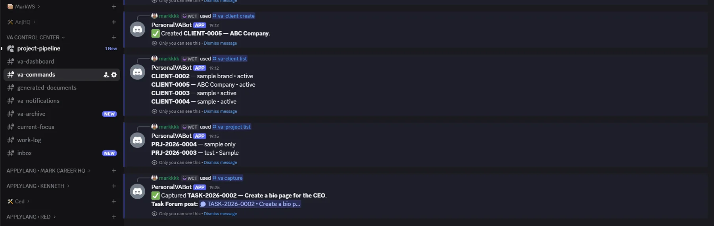

# PersonalVABot

**Local-first operations workspace for virtual assistants, agencies, and small remote teams.**

PersonalVABot is a Windows desktop and Discord-connected operations platform for organizing multi-client work, tasks, attendance, billing references, documents, templates, reminders, backups, and operational health in one place.

> **Current release:** Windows Desktop Beta `0.3.12`  
> **Source availability:** Private  
> **Public repository purpose:** Product documentation, screenshots, release notes, checksums, and installer downloads

[View the full case study](https://markbadong.com/projects/personalvabot)

---

## What PersonalVABot helps manage

- Multi-client workspaces and client memory
- Projects and task lifecycles
- Inbox, Active, Blocked, Review, Done, and Archived task states
- Task timers and linked outputs
- Attendance and DTR records
- Billing agreements and earnings references
- Invoice and document workflows
- Recurring tasks and reminders
- 72 reusable templates
- Smart recommended next actions
- Activity and health monitoring
- Backup, restore, and export workflows
- Credential-safe diagnostics
- Local SQLite data under the Windows user profile

---

## Product preview

### Dashboard

### Client management

### Task lifecycle

### Attendance and DTR

### Billing references

### Activity and health

### Discord-connected task capture

More screenshots are available in the [`screenshots`](screenshots) directory.

---

## Installation

The current Windows beta is distributed through GitHub Releases.

1. Open the latest release.
2. Download the Windows installer.
3. Verify the SHA-256 checksum when provided.
4. Run the installer.
5. Review the included installation and privacy notes before connecting a Discord bot.

See [`docs/INSTALLATION.md`](docs/INSTALLATION.md) for the full guide.

> The beta installer may be unsigned and can trigger Windows SmartScreen. Review the release notes and checksum before installation.

---

## Data and privacy model

PersonalVABot is local-first.

- Operational data is stored locally.
- Stable application data is preserved under `%APPDATA%\PersonalVABot`.
- Normal uninstall is designed to preserve the stable data directory.
- Backups and exports remain under the user's control.
- Discord credentials are never included in this repository.
- Tokens, databases, logs, backups, and client records must never be uploaded publicly.

See [`docs/PRIVACY-AND-DATA.md`](docs/PRIVACY-AND-DATA.md).

---

## Validation scope

The Windows beta has been tested for:

- installer launch;
- app startup and restart persistence;
- multi-client separation;
- client memory;
- project and task creation;
- lifecycle transitions;
- archive and reopen behavior;
- protected permanent deletion;
- attendance and DTR workflows;
- billing references;
- document workflows;
- recurring tasks and reminders;
- backup creation and restore behavior;
- local data persistence;
- credential-safe diagnostics.

See [`docs/VALIDATION.md`](docs/VALIDATION.md).

---

## Architecture overview

PersonalVABot combines:

- a Windows desktop launcher and local interface;
- a Discord-connected workflow layer;
- a local SQLite data store;
- scheduled and recurring operations;
- backup and export tooling;
- diagnostic and health checks;
- template-driven document and prompt workflows.

The complete application source is private. This repository intentionally contains only safe public proof and release documentation.

See [`docs/ARCHITECTURE.md`](docs/ARCHITECTURE.md).

---

## Status

PersonalVABot is a **Windows Desktop Beta**, not a final `1.0.0` production release.

Current focus:

- trusted beta testing;
- installer and upgrade safety;
- workflow reliability;
- documentation;
- privacy and recovery;
- feedback from real VA and remote-work scenarios.

Future web, Slack, multi-tenant, payroll, payslip, manager portal, and client portal capabilities remain planned unless separately announced as released.

---

## Creator and product ownership

Created and product-directed by **Mark Anton Badong**.

Mark's ownership includes:

- product vision;
- workflow architecture;
- feature requirements;
- user and lifecycle design;
- testing and validation;
- release direction;
- documentation;
- final product decisions.

Development used an AI-assisted workflow. Product vision, requirements, workflow design, validation, release direction, and final decisions remained under Mark's ownership.

- Portfolio: [markbadong.com](https://markbadong.com)
- GitHub: [markanton13](https://github.com/markanton13)
- Discord: `@markanton13`

---

## Repository safety

Do not upload:

- `.env` files;
- Discord tokens or application credentials;
- SQLite databases;
- real client or worker data;
- backups;
- logs;
- installer build secrets;
- private source code;
- internal upgrade packages.

Security issues should be reported privately. See [`SECURITY.md`](SECURITY.md).

---

## License

The application and source code are proprietary. Public documentation and screenshots are provided for evaluation and portfolio purposes only. See [`LICENSE.md`](LICENSE.md).
